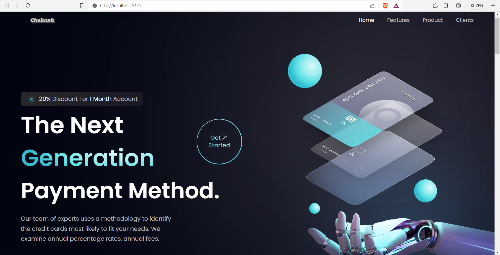

# Banking system Frontend with React and Vite

<p align="center">
  
  <br/>
</p>
<br/><br/>

## Introduction

Welcome to the Chebank Frontend project! This repository contains the frontend codebase for Chebank, a fictional bank. This project is built using React and Vite, providing a foundational understanding of React

## Setup Instructions

1. Clone the repository:
   ```bash
   https://github.com/SaviNimz/bank-frontend-react.git

2. Navigate to the project directory
   ```bash
   cd frontend
3. Install dependencies
   ```bash
   npm install
4. go to the src directory
   ```bash
   cd src
5. start the development server
   ```bash
   npm run dev

Then the local development server will start at http://localhost:5173/



